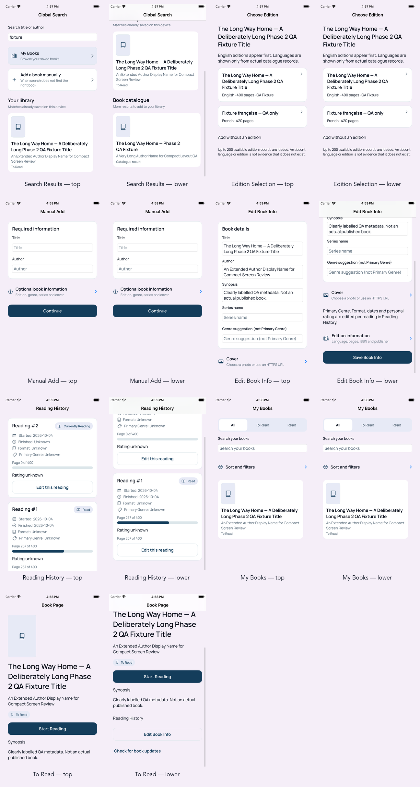
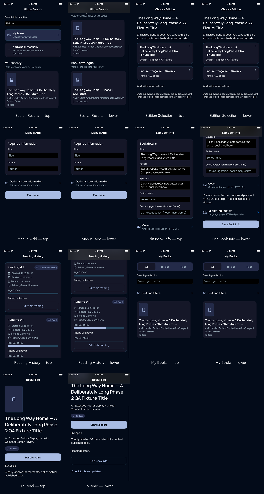
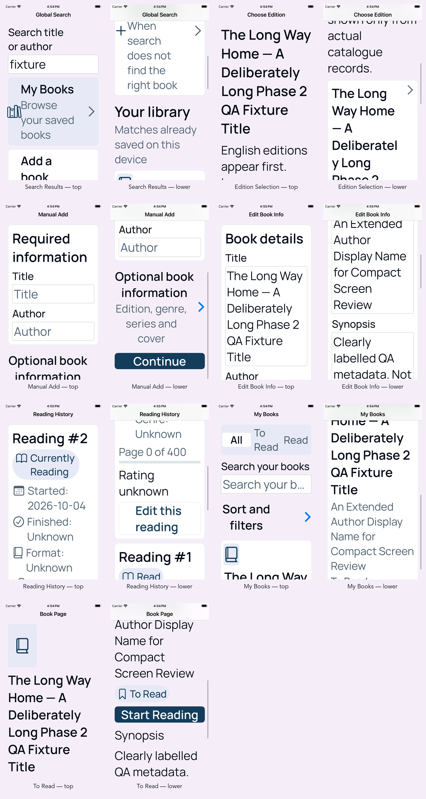

# Phase 2 — Human Visual QA correction pass

These targeted boards cover only the screens changed by the pre-merge visual
polish pass. Source captures use the same iPhone SE (3rd generation), portrait
configuration as the existing Phase 2 evidence. Each screen is shown at the top
and after one scroll so hierarchy and reflow can be reviewed together.

## Light Standard

## Dark Standard

## Accessibility XXXL

## Coverage

- Global Search with populated local and catalogue results
- Choose Edition
- Manual Add
- Edit Book Info
- Reading History
- My Books sort/filter affordance
- Book Page with `Synopsis`

The Accessibility XXXL board includes every corrected screen, including the
required Choose Edition and Reading History states. The boards use fictional QA
fixture data. They do not supersede the original Phase 2 evidence, imply approval,
or relabel retained Foundation accessibility findings as passing.
