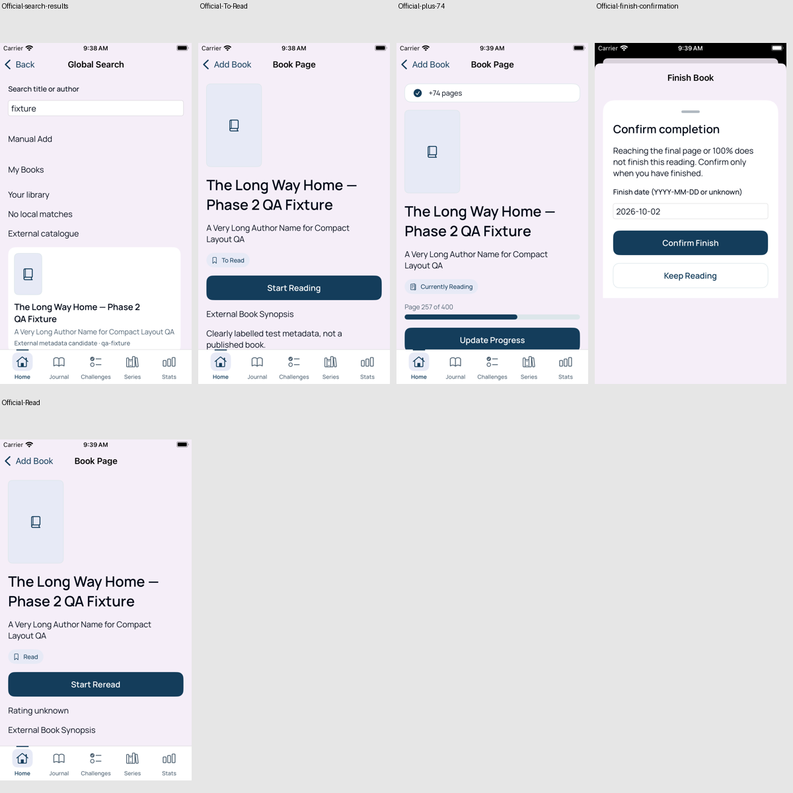
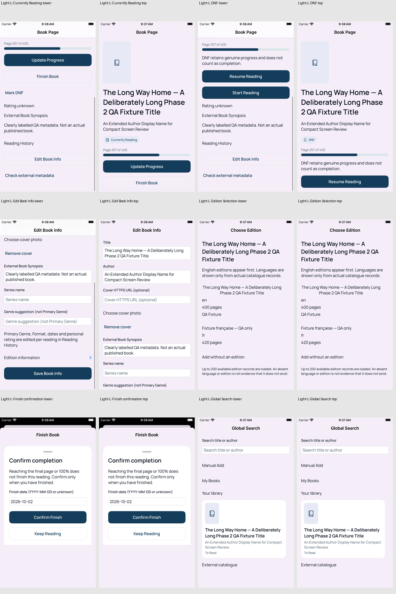
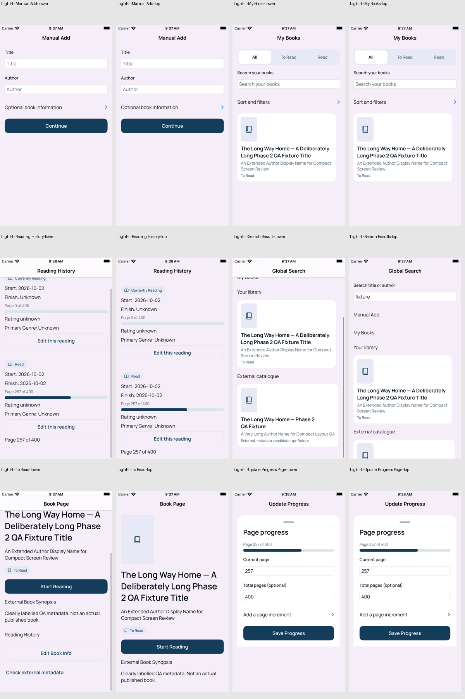
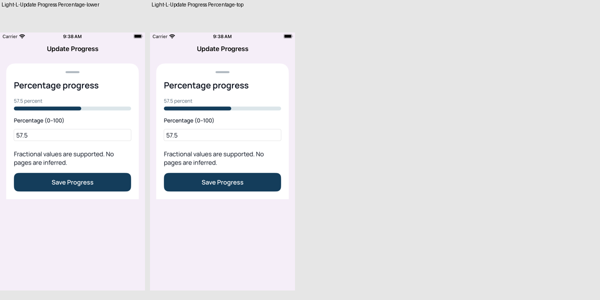
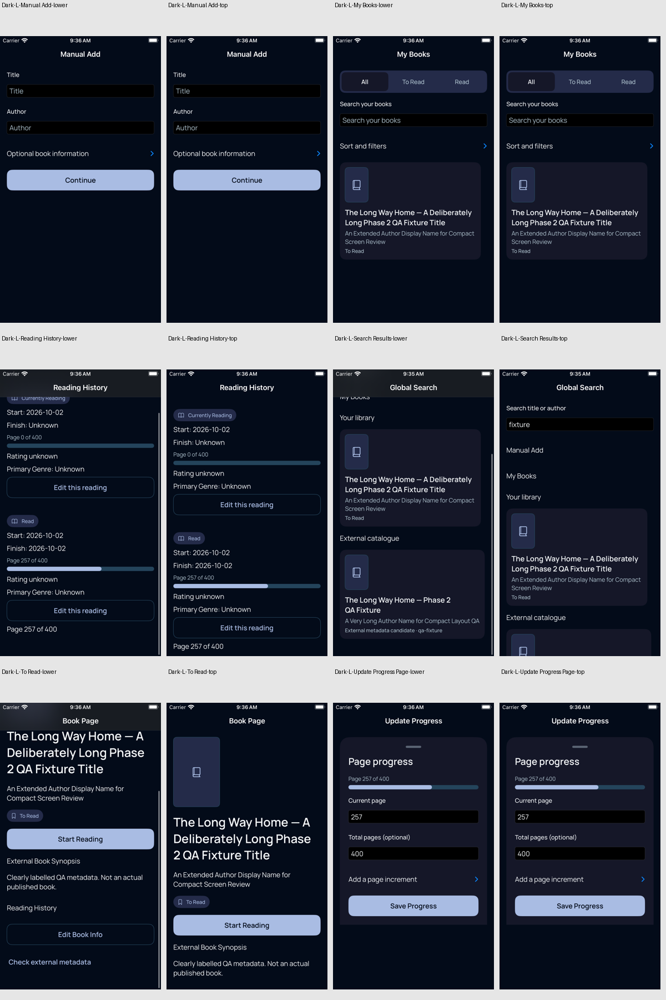
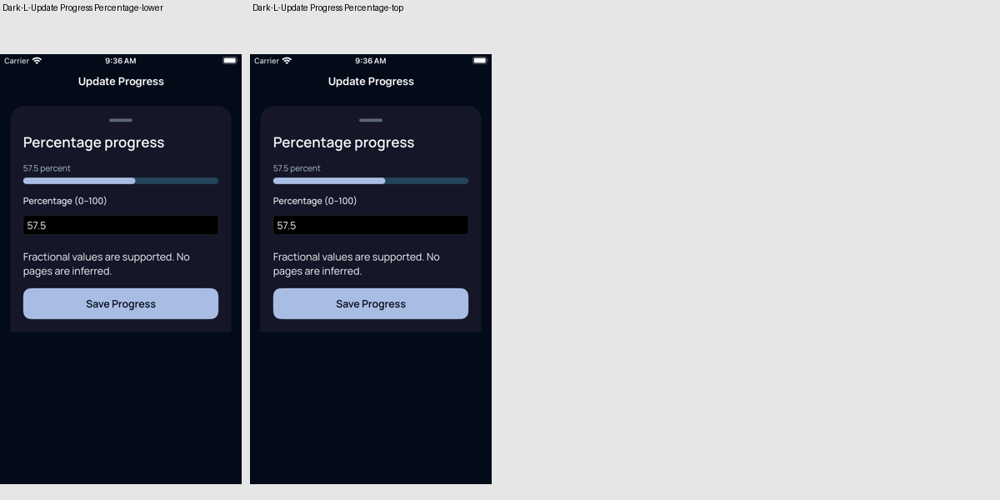
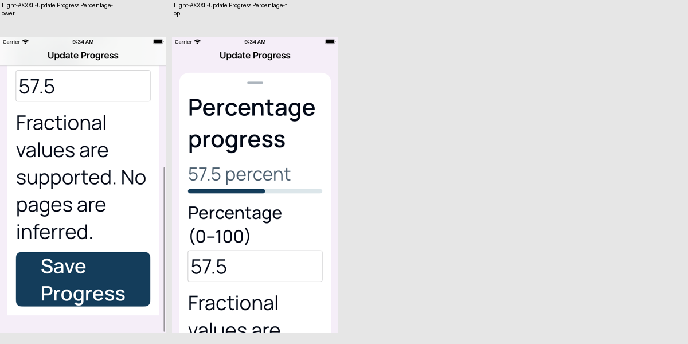

# Phase 2 — Human Visual QA

Source: [CI #110](https://github.com/angels00607/reading-companion/actions/runs/36987677905),
application/test commit `0405605b75c63597705ef363e99645da16575995`.
The Books Core acceptance stage passes with its 44-point checks unchanged.

Device: iPhone SE (3rd generation), 375 × 667 points. The 13 representative
states are captured at top and after scrolling in Light Standard, Dark Standard
and compact Accessibility XXXL. DEBUG fixtures are explicitly fictional QA data.
The representative routes are isolated screen launches; the official flow uses
the actual five-tab navigation shell. Complete Phase 12 accessibility and
physical-device/VoiceOver approval are not claimed.

## Official flow

Search → Add → Start → page 183 → page 257 → `+74 pages` → final page →
explicit confirmation → Read. XCTest checks each transition and the live input.
The five saved milestones are ordered chronologically in this board.

## Light Standard

## Dark Standard

## Compact Accessibility XXXL

## Original evidence and limits

[Download the CI visual QA artifact](https://github.com/angels00607/reading-companion/actions/runs/36987677905/artifacts/11219756710).
It contains `BooksCore.xcresult`, `books-core-screenshots/manifest.json` and all
83 original screenshots. Full foundation audit evidence is retained separately
in the same run's `phase-2-acceptance-results` artifact.

The captures were inspected for appearance, long text and vertical scrolling.
Partially visible text at viewport edges belongs to scrollable content; these
boards are not a conclusion that every native accessibility audit issue is false.
Empty prompts use semantic secondary-text colors and labelled fields remain
identifiable when prompts truncate at large sizes. No accessibility finding is
suppressed. See [Phase 2 status](../../PHASE_2_STATUS.md) for open foundation findings.

Human visual approval is required before merge. Phase 3 and merging are not authorized.
